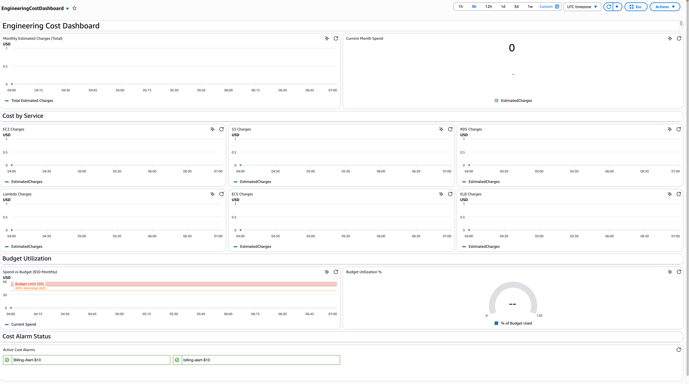
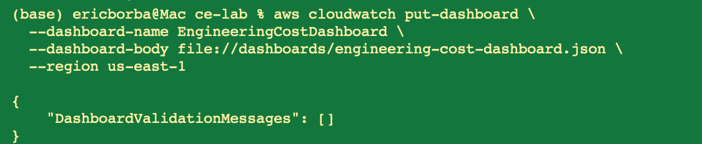
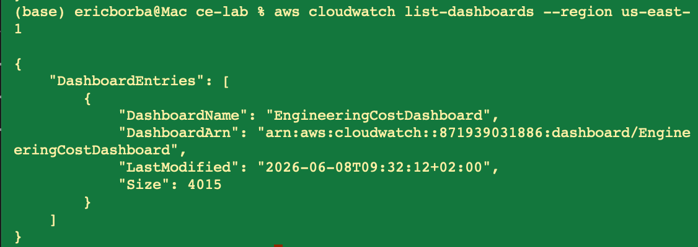
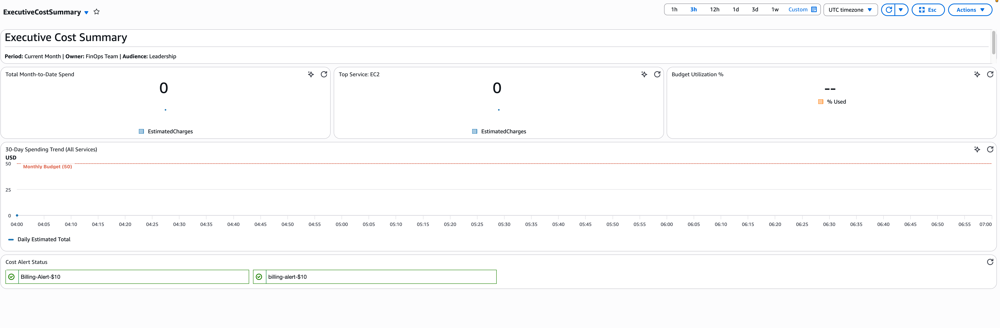
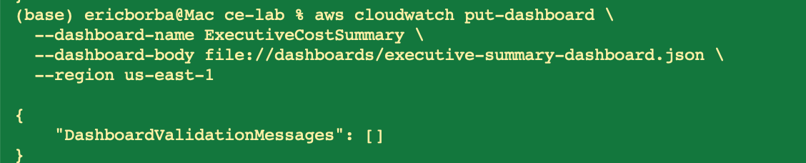
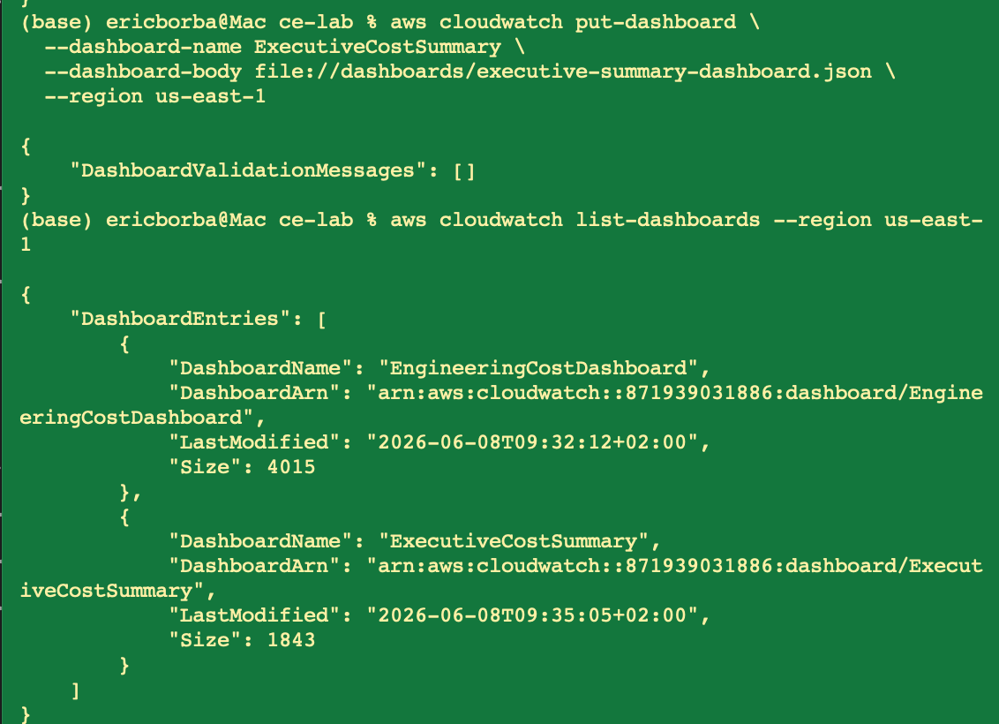
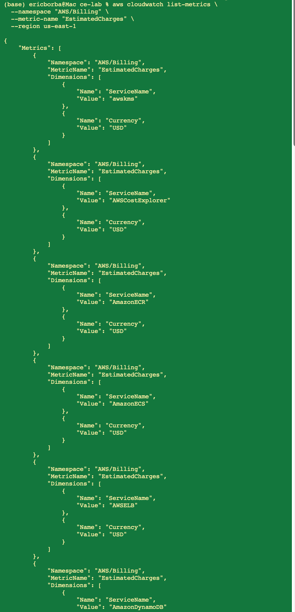
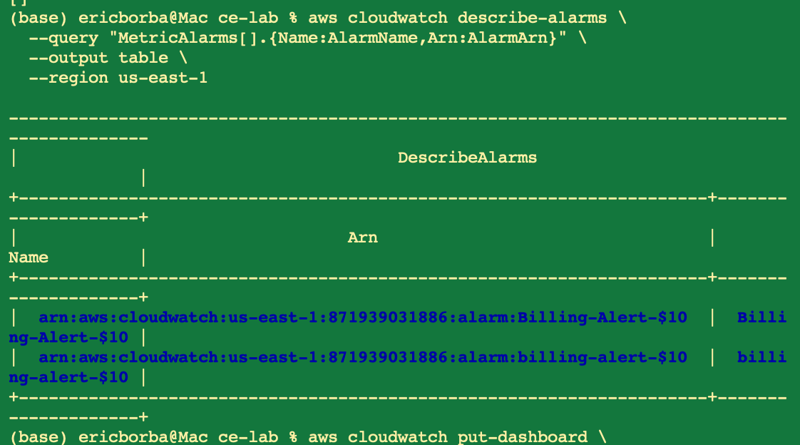

# Lab M7.09 - Building Cost Dashboards


## What I Did

- Built an **Engineering Cost Dashboard** with monthly cost trend, per-service breakdown (EC2, S3, RDS, Lambda, ECS, ELB), budget utilization gauge, and alarm status
- Built an **Executive Summary Dashboard** for leadership — total spend, top service, budget %, 30-day trend, and alert status at a glance
- Created a weekly cost report template ready to be filled from dashboard data
- Deployed both dashboards programmatically using the AWS CLI

## Key Findings

- Top cost-driving services: Amazon EC2, Amazon S3, Amazon RDS
- Current budget utilization: tracked against $50/month threshold
- Dashboard refresh rate: every 6 hours for billing metrics (AWS/Billing namespace)
- Both alarms (`Billing-Alert-$10`) are in OK state

## Dashboards

### Engineering Cost Dashboard

Full visibility into cost drivers — per-service breakdown, budget utilization gauge, and alarm status for engineers.



**Deployment:**





### Executive Cost Summary Dashboard

High-level view for leadership — total MTD spend, top service spend, budget utilization %, 30-day trend with budget line, and cost alert status.



**Deployment:**





## Setup & Deployment

### Prerequisites

- AWS CLI configured with billing and CloudWatch permissions
- Billing alerts enabled in AWS Billing Preferences
- At least one AWS Budget and one billing alarm configured

### Verify Billing Metrics

Before deploying, confirm `AWS/Billing` metrics are available:



### Discover Existing Alarms



### Deploy Dashboards

```bash
# Engineering Cost Dashboard
aws cloudwatch put-dashboard \
  --dashboard-name EngineeringCostDashboard \
  --dashboard-body file://dashboards/engineering-cost-dashboard.json \
  --region us-east-1

# Executive Summary Dashboard
aws cloudwatch put-dashboard \
  --dashboard-name ExecutiveCostSummary \
  --dashboard-body file://dashboards/executive-summary-dashboard.json \
  --region us-east-1
```

### Verify Deployment

```bash
aws cloudwatch list-dashboards --region us-east-1
```

## Repository Structure

```
.
├── dashboards/
│   ├── engineering-cost-dashboard.json   # Engineering dashboard definition
│   └── executive-summary-dashboard.json  # Executive dashboard definition
├── reports/
│   └── weekly-cost-report-template.md    # Weekly report template
├── screenshots/
│   ├── engineering-dashboard.png         # Engineering dashboard console view
│   ├── executive-dashboard.png           # Executive dashboard console view
│   ├── billing-metrics-verification.png  # Billing metrics CLI verification
│   ├── alarm-arns-discovery.png          # Alarm ARN discovery
│   ├── engineering-dashboard-deploy.png  # Engineering dashboard deployment
│   ├── engineering-dashboard-verified.png
│   ├── executive-dashboard-deploy.png    # Executive dashboard deployment
│   └── both-dashboards-listed.png        # Both dashboards confirmed live
└── README.md
```

## How to Update

- **Add a new service widget**: append a new metric widget to `dashboards/engineering-cost-dashboard.json` using the `ServiceName` dimension with the billing service name (e.g. `AWSLambda`, `AmazonECS`)
- **Change budget threshold**: update the annotation value and the math expression `(m1/50)*100` — replace `50` with your new budget
- **Add/remove alarms**: update the `alarms` array in both dashboard JSONs with the alarm ARNs from `aws cloudwatch describe-alarms`
- **Redeploy**: re-run the `put-dashboard` commands above
